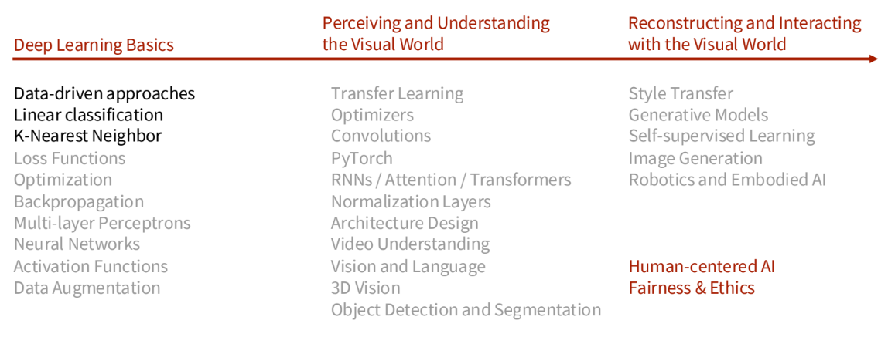

# Stanford CS231N Deep Learning for Computer Vision | Spring 2025 | Lecture 2: Image Classification with Linear Classifiers

> Link: [Lecture Video](https://youtu.be/pdqofxJeBN8?si=bDjuYjE54yVT-zPl)  
> Slide: [Slide](https://cs231n.stanford.edu/slides/2025/lecture_2.pdf)

----

## Syllabus

## Image Classification Task

### Image Classification: Core task of CV
- What to do?
  - 

## Data Driven Approaches to Image Classification

### K-nearest Neighbor

### Linear Classifier